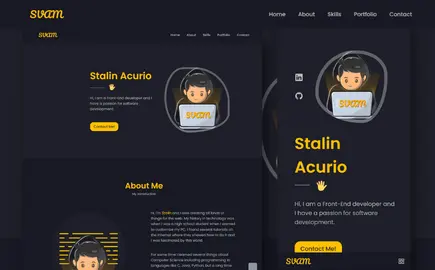

# Template Portfolio

This portfolio was based on a youtube tutorial by [Cryptical Coder](https://www.youtube.com/watch?v=3aCoZudPEKE&t=5875s&ab_channel=CrypticalCoder) with the purpose of practicing and modifying different parts of the project to my liking.

## Table of contents

- [Template Portfolio](#template-portfolio)
  - [Table of contents](#table-of-contents)
  - [Overview](#overview)
    - [Links](#links)
  - [My process](#my-process)
    - [Built with](#built-with)
  - [Author](#author)

## Overview

### Links

- Live Site URL: [StalinAM](https://template-portfolio-svam.netlify.app/)
- Tutorial [Cryptical Coder](https://www.youtube.com/watch?v=3aCoZudPEKE&t=5875s&ab_channel=CrypticalCoder)

## My process

### Built with

- [Vitejs](https://vitejs.dev/)
- [React.js](https://reactjs.org/)
- [Styled-components](https://styled-components.com/docs/basics)
- [EmailJS](https://www.emailjs.com/)

## Author

- GitHub - [StalinAM](https://github.com/StalinAM)
